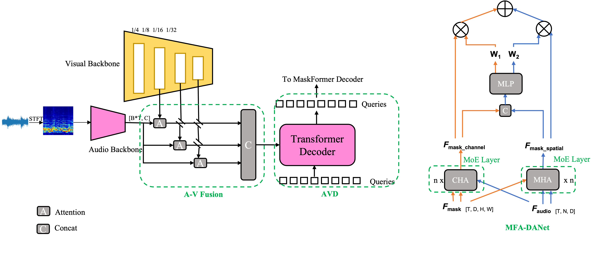

# MoDAT
Audio-Visual Segmentation (AVS) task aims to precisely segments audible objects using audio cues down to pixel level. Existing works tackle this challenge by modelling the correlation between modalities. However, these fusing methods generally overlook the audio information in high-density audio signals and overemphasize the visual information, resulting in the inability to correspond the audio components to their visual counterparts and to receive interference from salient but inaudible objects. In this report, we propose a novel Mixture of Dual-Attention Transformer (MoDAT) that adopts MaskFormer architecture to fully exploit audio cues. Specifically, our MoDAT disentangles audio components from intertwined audio features to generate distinct queries for MaskFormer decoder and introduces a cross-modal fusion module that combines channel-wise and spatial cross attention adaptively between per-pixel embeddings and audio embeddings. To encourage more robust audio-visual representations without increasing computational overhead, a mixture of cross attention experts are found to be effective in scaling up networks. Extensive experiments on AVSBench show our method achieves a new state-of-the-art performance, especially on the multi-source subsets, demonstrating the MoDAT has substantial potential to capitalize on complex audio cues.

## Method




## 🛠️ Get Started

### 1. Environments
```shell
# recommended
pip install torch==1.10.0+cu113 torchvision==0.11.0+cu113 torchaudio==0.10.0+cu113 -f https://download.pytorch.org/whl/torch_stable.html
pip install mmcv-full
pip install pandas
pip install timm
pip install resampy
pip install soundfile
pip install librosa
# build MSDeformAttention
cd ops
sh make.sh
```


### 2. Data

Please refer to the link [AVSBenchmark](https://github.com/OpenNLPLab/AVSBench) to download the datasets. You can put the data under `data` folder. The `data` directory is as bellow:
```
|--data
   |--AVSS
   |--Multi-sources
   |--Single-source
```
You can download the S4 and MS3 subset via [Baidu Netdisk](https://pan.baidu.com/s/1gXYo_hN-iwdkvRpSoHK7yw) (password: ufwn) or [Google Drive](https://drive.google.com/drive/folders/1vPU6yPHpNJ5mC9zdgsZ8R_AS4-tgHtY6?usp=sharing)

You can download the AVSS subset via [Baidu Netdisk](https://pan.baidu.com/s/16GOnun4A79ffCDMCXMvI0w?pwd=ez4i) (password: ez4i), [Dropbox](https://www.dropbox.com/sh/oaeiylix0jjjawu/AAApc245zlwF5f5EqVz_Ym8Ua?dl=0) or [OneDrive](https://1drv.ms/u/s!AmFC2hZytlk8goBZ1Qbl2D1GYRQmcQ?e=EPMzOC)

**Recommendation**: I recommend to download the AVSS subset preprocessed by myself via [Aliyun]() in order to accerlerate training process. The difference between the AVSS subset provided by me and the original data is that I resized the image to 224x224 and converted the audio file .wav to log mel spectrum in advance. As a result, storage costs are reduced and there is no need for pre-processing during training and inference.

### 3. Download Pre-Trained Models

- The pretrained backbone is available from benchmark [AVSBench pretrained backbones](https://drive.google.com/drive/folders/1386rcFHJ1QEQQMF6bV1rXJTzy8v26RTV).
- We provides the best pre-trained models (i.e PVT-v2 and VGGish as visual and audio backbone) for all three subtasks. You can download them from the links below.

|Method|Backbone|Subset|Size|Lr schd|Config|mIoU|F-score|Download|
|:---:|:---:|:---:|:---:|:---:|:---:|:---:|:---:|:---:|
|MoDAT-PVTv2|PVTv2-B5|S4|224|30ep|[config](config/s4/MoDAT_pvt2_s4.py)|82.41|90.3|[ckpt](https://pan.baidu.com/s/1jA0bqMzRReSlC66wtEhasw?pwd=gcpf) (password: gcpf)|
|MoDAT-PVTv2|PVTv2-B5|MS3|224|60ep|[config](config/ms3/MoDAT_pvt2_ms3.py)|61.50|72.0|[ckpt](https://pan.baidu.com/s/1u6bDxWDTcQRt9M_90hemkg?pwd=mp4k) (password: mp4k)|
|MoDAT-PVTv2|PVTv2-B5|AVSS|224|30ep|[config](config/avss/MoDAT_pvt2_avss.py)|37.16|42.4|[ckpt](https://pan.baidu.com/s/1jgU2ONzG3JZH7KYFtUtpBQ?pwd=atxh) (password: atxh)|


### 4. Train
```shell
TASK = "s4"  # or ms3, avss
CONFIG = "config/s4/AVSegFormer_pvt2_s4.py"

bash train.sh ${TASK} ${CONFIG}
```


### 5. Test
```shell
TASK = "s4"  # or ms3, avss
CONFIG = "config/s4/AVSegFormer_pvt2_s4.py"
CHECKPOINT = "work_dir/AVSegFormer_pvt2_s4/S4_best.pth"

bash test.sh ${TASK} ${CONFIG} ${CHECKPOINT}
```


## Acknowledgement
Some of my code is copied from [AVSegFormer](https://github.com/vvvb-github/AVSegFormer/tree/master) and [mixture-of-experts](https://github.com/lucidrains/mixture-of-experts/tree/master). I appreciate their work very much.

If you have any question or problem with this code, please contact me at [jnjz921@126.com](jnjz921@126.com) or [u3603356@connect.hku.hk](u3603356@connect.hku.hk)

